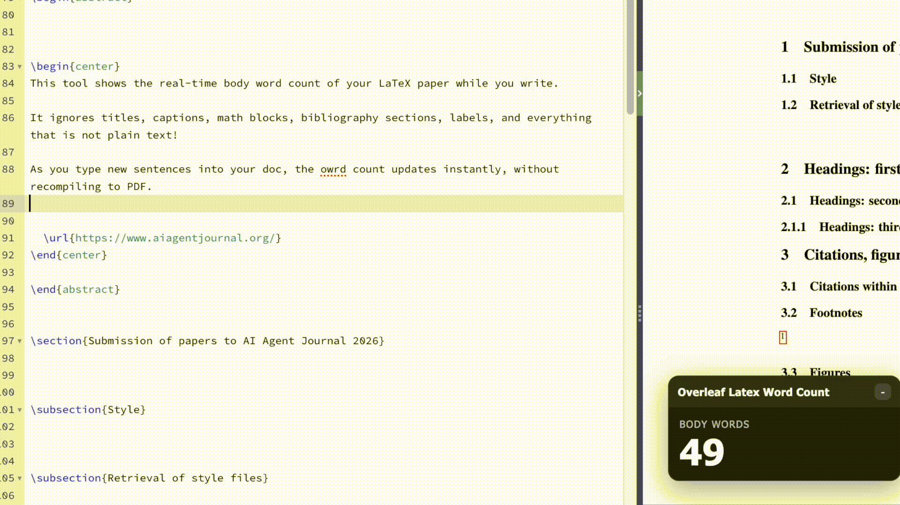

# TexSense: Real-time word count for Overleaf

TexSense is a browser extension that counts words in LaTeX as you type.

No more recompiling or downloads. With TexSense, you can see your word count in real time. 

### Try it on [Chrome](https://chromewebstore.google.com/detail/texsense-real-time-overle/npggjbabdlnmiamalfkbpdjpgbdlhfkj) or [Firefox](https://addons.mozilla.org/en-US/firefox/addon/texsense/) now!





## Word Count Rules

The parser counts body words from LaTeX source and excludes non-body content.

Exclusions:

- Comments (`% ...`)
- Everything outside `\begin{document}...\end{document}` (when present)
- Commands with arguments:
  - `\title{...}`
  - `\author{...}`
  - `\date{...}`
  - `\url{...}`
  - `\label{...}`
  - `\bibliography{...}`
  - `\footnote{...}`
  - `\footnotetext{...}`
  - `\section{...}`
  - `\subsection{...}`
  - `\subsubsection{...}`
  - `\caption{...}`
- Single commands:
  - `\maketitle`
  - `\tableofcontents`
- Full environments:
  - `figure`, `figure*`
  - `table`, `table*`
  - `bibliography`, `thebibliography`
  - `equation`, `equation*`
  - `align`, `align*`
  - `math`, `displaymath`
- Math blocks:
  - `$$...$$`
  - `\[...\]`
  - `\(...\)`
  - inline `$...$`
- All `\begin{...}` / `\end{...}` tags themselves
- Remaining LaTeX commands and escaped control sequences

## Local setup

```bash
npm install
npm run build
```

## Development build (watch)

```bash
npm run dev
```

This keeps rebuilding `dist/` when files change.

## Load unpacked extension in Chrome

1. Open `chrome://extensions/`
2. Enable **Developer mode** (top-right)
3. Click **Load unpacked**
4. Select this project's `dist/` folder
5. Open [https://www.overleaf.com](https://www.overleaf.com) and create a project
6. Navigate to the `.tex` file page to see the word counter

## Load local add-on in Firefox

1. Open about:debugging
2. Click This Firefox in the sidebar
3. Click Load Temporary Add-on…
4. Select the project's manifest.json file inside the source or build directory
5. Open [https://www.overleaf.com](https://www.overleaf.com) and create a project
6. Navigate to the `.tex` file page to see the word counter

Note: Firefox temporary add-ons will disappear when Firefox is restarted. Reload the add-on if needed.

## Files

- `manifest.json`: extension manifest (copied to `dist/`)
- `src/contentScript.tsx`: entrypoint, Overleaf integration, update loop
- `src/injected.tsx`: page-context bridge to Overleaf CodeMirror state
- `src/floatingPanel.tsx`: draggable React UI panel
- `src/parser.ts`: LaTeX-to-body-text parser + word counting
- `src/styles.css`: floating panel styles
- `vite.config.ts`: build config
